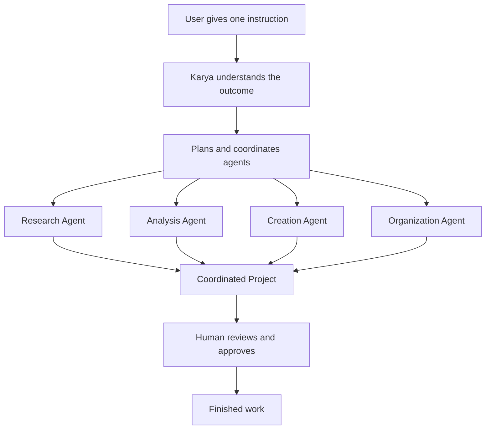
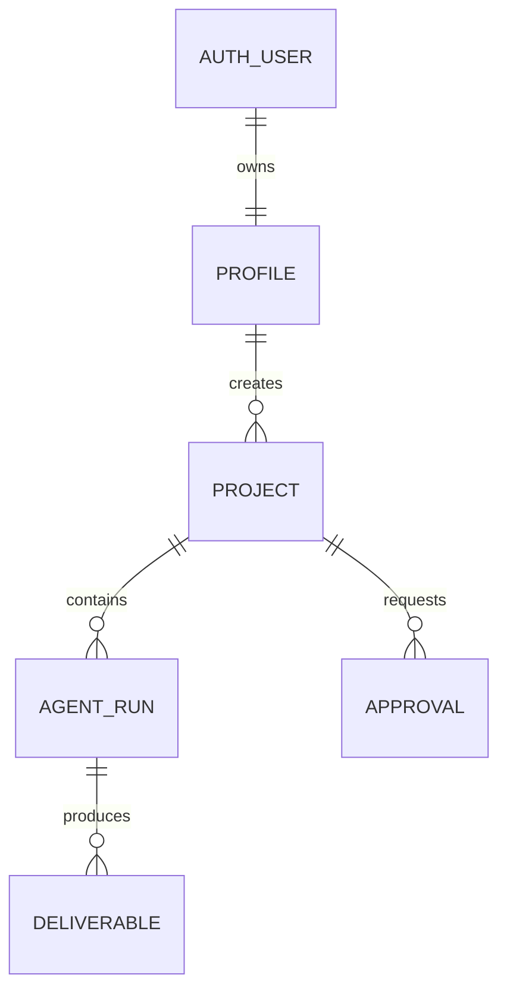

<div align="center">
  

# KARYA

### **THE INTERNET, ON YOUR COMMAND.**

**One instruction in. Coordinated AI agents move. Finished work comes out.**

[](https://www.python.org/)
[](https://flask.palletsprojects.com/)
[](https://jinja.palletsprojects.com/)
[](https://www.typescriptlang.org/)
[](#project-status)

`#C8FF4D` · India-first · Voice-ready · Human-controlled

</div>

---

## ⚡ Karya in 20 seconds

Most software makes people learn tools, open tabs, move files, repeat context and manually connect every step.

**Karya starts with the outcome.** A user explains what they want in natural language. Karya plans the work, routes it to specialised agents and keeps the project coherent from beginning to end.

```text
YOUR INTENT
    │
    ▼
┌────────────────────────────────────────────┐
│                  KARYA                     │
│  Research → Analyse → Create → Organise    │
└────────────────────────────────────────────┘
    │
    ▼
FINISHED, STRUCTURED WORK
```

> **Stop learning every tool. Just explain the outcome.**

---

## 🧠 The product idea



Karya is designed to become an action layer between people and the internet:

- **Outcome first** — users describe what they want to accomplish, not which tools to operate.
- **Coordinated intelligence** — specialized agents work together instead of producing disconnected responses.
- **Projects, not isolated chats** — research, sources, files, decisions, and deliverables stay organized around an outcome.
- **Human control** — consequential actions should remain visible, reviewable, and explicitly approved.
- **Accessible interaction** — Karya is designed toward natural text, voice, and Indian-language interaction.

---

## 🌐 One repository, two experiences

| Experience | Purpose | Routes |
|---|---|---|
| **Official website** | Explain Karya, its vision and pricing | `/`, `/about`, `/pricing`, `/early-access` |
| **Karya web app** | Enter the product and create projects | `/login`, `/app` |

The official site and web-app UI share one Flask application, one Jinja template system, one static directory and one build configuration.

---

## 🧱 Architecture & Technology Stack

### Current Stack

| Layer | Technology | Why it exists |
|---|---|---|
| Server | **Python + Flask** | Small, readable application and route layer |
| Templates | **Jinja2** | Shared document shell, reusable pages and route-safe links |
| Browser logic | **TypeScript** | Safer source code for interactions and state |
| Runtime logic | **JavaScript** | Browser-ready compiled output |
| Styling | **Local Tailwind CSS + custom CSS** | Fast utility layer without a CDN dependency |
| Temporary persistence | **localStorage** | Prototype project persistence |

### Planned MVP Architecture

```text
                          KARYA
                            │
                   Web Application
                            │
               ┌────────────┴────────────┐
               ▼                         ▼
         Application API             Supabase
               │                 ┌──────┼──────┐
               │                 ▼      ▼      ▼
               │                Auth Postgres Storage
               │
               ▼
         Karya Orchestrator
               │
       ┌───────┼────────┬───────────┐
       ▼       ▼        ▼           ▼
      LLM   Web Research Files   Data/Charts
       │       │        │           │
       └───────┴────────┴───────────┘
               │
               ▼
         Project Workspace
```

---

## 🛣️ Routes

| Method | Route | Screen | Current state |
|---|---|---|---|
| `GET` | `/` | Marketing landing page | ✅ Ready |
| `GET` | `/about` | Mission, agents and vision | ✅ Ready |
| `GET` | `/pricing` | Country-aware pricing | ✅ Ready |
| `GET` | `/early-access` | Early-access request UI | ✅ Frontend |
| `GET` | `/login` | Google/Supabase sign-in UI | 🟡 Simulated |
| `GET` | `/app` | Karya workspace | 🟡 Frontend preview |
| `GET` | `/health` | JSON service health | ✅ Ready |

---

## 🗂️ Project map

```text
Karya/
├── .gitignore
├── README.md                      # Project documentation
├── TECHNOLOGY_EXPLANATION.md
├── app.py                         # Flask application and routes
├── package-lock.json
├── package.json                   # TypeScript build scripts
├── requirements.txt               # Python dependencies
├── tailwind.config.js
├── tsconfig.json
│
├── static/
│   ├── assets/
│   │   └── karya-icon.svg
│   ├── css/
│   │   ├── about.css
│   │   ├── auth.css
│   │   ├── early-access.css
│   │   ├── landing.css
│   │   ├── pricing.css
│   │   ├── shared.css
│   │   ├── tailwind.css
│   │   └── workspace.css
│   ├── js/                        # Compiled browser JavaScript
│   │   ├── about.js
│   │   ├── auth.js
│   │   ├── early-access.js
│   │   ├── landing.js
│   │   ├── pricing.js
│   │   └── workspace.js
│   └── src/                       # Editable TypeScript
│       ├── about.ts
│       ├── auth.ts
│       ├── early-access.ts
│       ├── landing.ts
│       ├── pricing.ts
│       └── workspace.ts
│
├── templates/
│   ├── about.html                 # About Karya
│   ├── auth.html                  # Sign-in frontend
│   ├── base.html                  # Shared Jinja document shell
│   ├── early-access.html          # Early-access form
│   ├── index.html                 # Official landing page
│   ├── pricing.html               # Pricing experience
│   └── workspace.html             # Main web-app UI
│
└── tests/
    ├── __init__.py
    └── test_routes.py             # Flask route smoke tests
```

---

## 🚀 Launch locally

### Prerequisites
- Python 3.10+
- Node.js and npm

### 1. Clone the repository

```bash
git clone <your-repository-url>
cd karya-combined
```

### 2. Create the Python environment

```bash
python -m venv .venv
```

Activate it:

```bash
# macOS / Linux
source .venv/bin/activate

# Windows PowerShell
.venv\Scripts\Activate.ps1
```

### 3. Install dependencies

```bash
pip install -r requirements.txt
npm install
```

### 4. Compile TypeScript

```bash
npm run build
```

### 5. Start Karya

```bash
python app.py
```

Open: `http://127.0.0.1:5000`

---

## 🎛️ Commands & Testing

| Command | Action |
|---|---|
| `npm run build` | Compile `static/src/*.ts` into `static/js/*.js` |
| `npm run start` | Start the Flask application through Python |
| `npm run dev` | Start Flask in debug mode on port `5000` |
| `python -m unittest discover -s tests -v` | Run route smoke tests |

Before shipping visual changes, verify:
- Desktop (`1440px`), Laptop (`1024px`), Tablet (`768px`), Mobile (`390px`)
- Browser console has no errors
- Pricing never renders blank
- Project creation survives a refresh

---

## 🚦 Roadmap & Project Status

### Phase 1 — Product foundation
- [x] Unified Flask project & Jinja architecture
- [x] Official marketing website (Landing, About, Pricing, Early-access)
- [x] Responsive product UI (Login, Workspace)
- [x] TypeScript browser interactions & Local Tailwind output
- [x] Pricing localisation (Country-aware pricing: USD, INR, GBP, EUR, CAD, AUD, SGD, AED, JPY)
- [x] Route health check and smoke tests
- [ ] Create a Supabase project and configure Google OAuth
- [ ] Create PostgreSQL profiles and projects tables
- [ ] Replace localStorage with a project repository backed by Supabase

### Phase 2 — Karya intelligence
- [ ] LLM integration
- [ ] Structured task planning
- [ ] Web research with sources
- [ ] Orchestration layer & Live execution progress

### Phase 3 — Finished work
- [ ] Reports and document generation
- [ ] Spreadsheet/data workflows
- [ ] Charts and analysis
- [ ] Presentation generation
- [ ] Artifact and source organization

### Phase 4 — Action layer
- [ ] Connected applications
- [ ] Explicit approval workflows
- [ ] Background and scheduled tasks
- [ ] Voice interaction
- [ ] Indian-language experiences

---

## 🧩 Future data model



---

## 🎨 Visual system

```css
--karya-lime: #C8FF4D;
--karya-night: #0B0C10;
```

- Dark industrial interface
- High-contrast lime actions
- Bold editorial typography
- Thin technical borders
- Monospace labels
- Minimal elevation

The experience is intentionally **not** a generic SaaS dashboard. It should feel like a command centre for completed work.

---

## 🔐 Security truth

This repository is currently a **frontend product prototype**, not a production authentication system.
- Do not collect real credentials in the simulated sign-in flow.
- Keep API keys and secrets in environment variables.
- Never expose Supabase service-role credentials in browser code.
- Enable PostgreSQL Row Level Security for user-owned data.
- Add CSRF and appropriate request protections where applicable.
- Require explicit user approval before consequential external actions.
- Disable Flask debug mode in production.

---

## 🛠️ Troubleshooting

### `ModuleNotFoundError: No module named 'flask'`
Activate the virtual environment and install requirements:
```bash
source .venv/bin/activate
pip install -r requirements.txt
```

### `tsc: command not found`
Install the Node dependencies:
```bash
npm install
npm run build
```

### Prices are blank
Confirm that `static/js/pricing.js` exists and that the browser console has no blocked-resource errors. The pricing code safely falls back to USD.

---

## 🧭 The north star

> Karya should become the trusted interface through which people interact with the internet—not by opening more applications, but by explaining what they want to accomplish.

<div align="center">

### **IDEAS IN. FINISHED WORK OUT.**

Built for the way India thinks, speaks and works.

**Karya · 2026**

</div>
